# Kanya House of Sarees

A full-stack saree e-commerce web application built with **HTML, CSS, JavaScript, Python, Django, Django REST Framework, MySQL, PostgreSQL, and REST APIs**.

The application includes authentication, product browsing, category filtering, cart and wishlist functionality, checkout, order management, stock validation, profile management, password reset through Brevo, Cloudinary image storage, and a Django admin dashboard.

## Overview

Kanya House of Sarees allows users to:

* Browse sarees by category
* View product details
* Create an account and log in
* Manage their profile
* Add products to the cart
* Add products to the wishlist
* Validate stock availability
* Complete checkout
* Place and view orders
* View order details
* Reset their password through email

The frontend is built with **HTML, CSS, and JavaScript**.

The backend is built with **Python, Django, and Django REST Framework** and exposes REST API endpoints consumed by the frontend.

**MySQL** is used for local development, while **PostgreSQL** is used in production through **Neon**.

## Features

* User registration and login
* Password validation
* Forgot-password functionality
* Password reset through Brevo email API
* Product browsing
* Product category filtering
* Product details
* Shopping cart
* Add, update, and remove cart items
* Wishlist functionality
* Stock availability validation
* Quantity validation based on available stock
* Checkout process
* Order placement
* Order history
* Order details
* User profile management
* Protected pages for authenticated users
* REST API integration
* Django admin dashboard
* Responsive frontend design

## Live Demo

**Frontend:**
https://kanya-sarees-frontend.onrender.com

**Backend API:**
https://kanya-sarees-backend.onrender.com/api/products/

**Django Admin:**
https://kanya-sarees-backend.onrender.com/admin/

## Technology Stack

### Frontend

* HTML5
* CSS3
* JavaScript

### Backend

* Python
* Django
* Django REST Framework

### Database

* MySQL — local development
* PostgreSQL — production through Neon

### Email

* Brevo Transactional Email API

### Storage

* Cloudinary — product image storage in production

### Deployment

* Render

### Development Tools

* Visual Studio Code
* Git
* GitHub
* GitHub Desktop
* Postman

## Project Architecture

```text
Frontend
   ↓
Django REST API
   ↓
PostgreSQL / MySQL
   ↓
Authentication
   ↓
Products
   ↓
Cart
   ↓
Wishlist
   ↓
Checkout
   ↓
Orders
```

External services:

```text
Django
 ├── Brevo → Password reset emails
 └── Cloudinary → Product image storage
```

## Project Structure

```text
kanya-sarees/
│
├── backend/
│   ├── accounts/
│   │   ├── management/
│   │   │   ├── __init__.py
│   │   │   └── commands/
│   │   │       ├── __init__.py
│   │   │       └── create_admin.py
│   │   └── ...
│   │
│   ├── config/
│   ├── products/
│   ├── manage.py
│   ├── products_data.json
│   └── upload_images.py
│
├── frontend/
│   ├── assets/
│   │   ├── css/
│   │   ├── images/
│   │   └── js/
│   │
│   └── pages/
│
├── screenshots/
├── .gitignore
└── README.md
```

The `create_admin.py` custom management command is used to create an admin user for the deployed application.

The `products_data.json` file contains product fixture data, while `upload_images.py` is used to upload product images to Cloudinary.

## API Endpoints

### Product Endpoints

| Method | Endpoint              | Description                 |
| ------ | --------------------- | --------------------------- |
| GET    | `/api/products/`      | Retrieve all products       |
| GET    | `/api/products/<id>/` | Retrieve a specific product |

### Authentication and Account Endpoints

| Method | Endpoint                         | Description                               |
| ------ | -------------------------------- | ----------------------------------------- |
| POST   | `/api/accounts/signup/`          | Create a new account                      |
| POST   | `/api/accounts/login/`           | Log in a user                             |
| GET    | `/api/accounts/profile/`         | Retrieve the authenticated user's profile |
| POST   | `/api/accounts/update-profile/`  | Update the authenticated user's profile   |
| POST   | `/api/accounts/forgot-password/` | Request a password reset                  |
| POST   | `/api/accounts/reset-password/`  | Reset the password                        |

## Installation and Setup

### 1. Clone the Repository

```bash
git clone https://github.com/dhanapriyakolli-gif/kanya-sarees.git
cd kanya-sarees
```

### 2. Navigate to the Backend

```bash
cd backend
```

### 3. Create a Virtual Environment

```bash
python -m venv venv
```

### 4. Activate the Virtual Environment

For Windows:

```bash
venv\Scripts\activate
```

### 5. Install Dependencies

```bash
pip install -r requirements.txt
```

### 6. Configure Environment Variables

Create a `.env` file inside the `backend` folder for local development.

The project uses environment variables for sensitive configuration such as:

* Django secret key
* Database credentials
* Production database URL
* Cloudinary credentials
* Brevo API key

Never upload `.env`, passwords, API keys, database credentials, or other secrets to GitHub.

### 7. Configure the Local Database

Create a MySQL database named:

```text
kanya_sarees
```

Configure the required database credentials through your environment variables.

For production, the project uses PostgreSQL through Neon.

### 8. Run Migrations

```bash
python manage.py makemigrations
python manage.py migrate
```

### 9. Start the Django Development Server

```bash
python manage.py runserver
```

The backend will be available at:

```text
http://127.0.0.1:8000/
```

### 10. Run the Frontend

Open the frontend folder in Visual Studio Code and run it using a local development server such as the VS Code Live Server extension.

Example:

```text
http://127.0.0.1:5500/frontend/pages/
```

## Deployment

The application is deployed using:

* **Render** — frontend hosting
* **Render** — Django backend hosting
* **Neon** — production PostgreSQL database
* **Cloudinary** — product image storage
* **Brevo** — transactional password-reset emails

## Screenshots

### Home Page

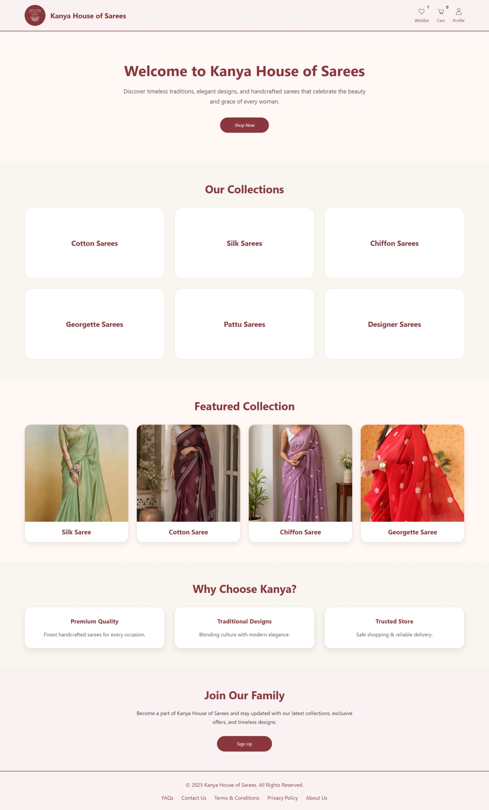

### Products Page

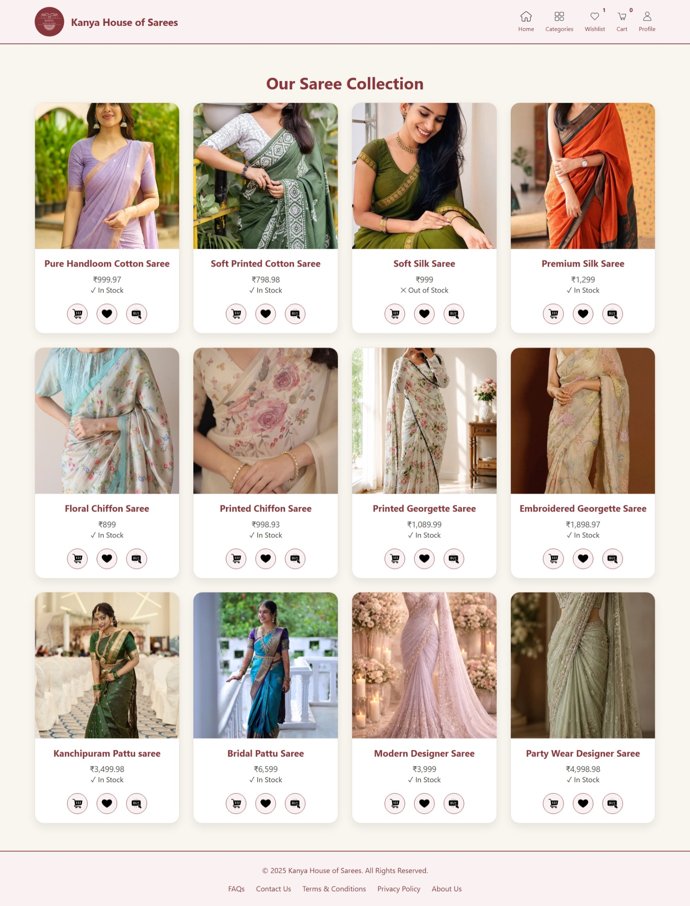

### Categories Page

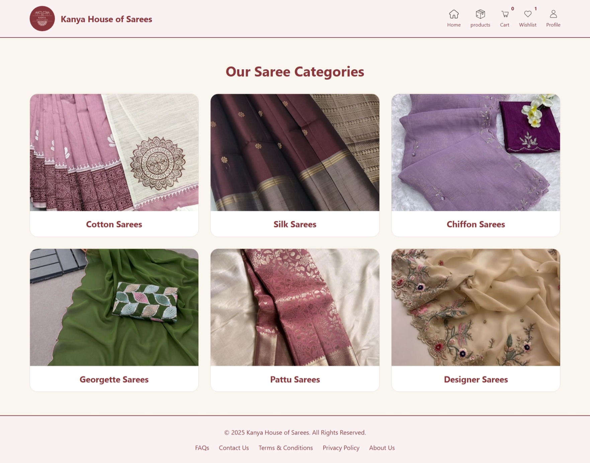

### Cart Page

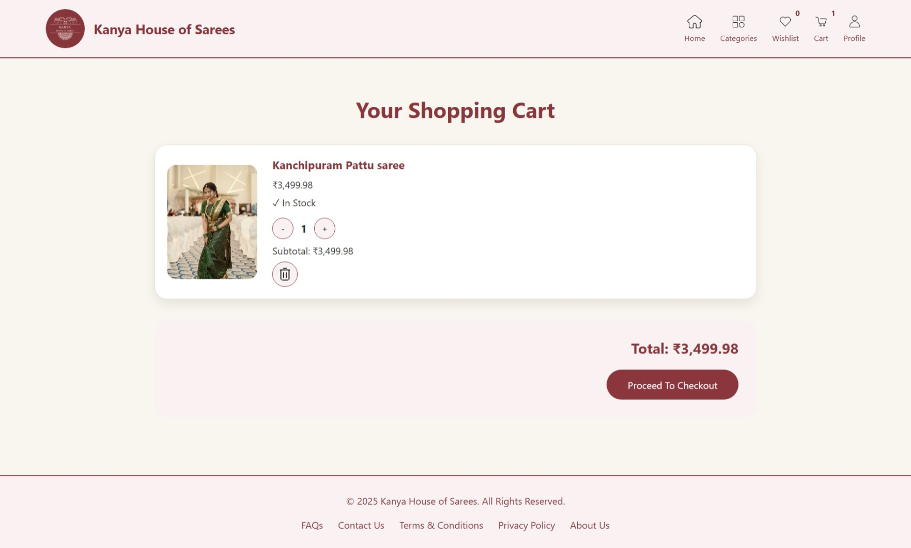

### Wishlist Page

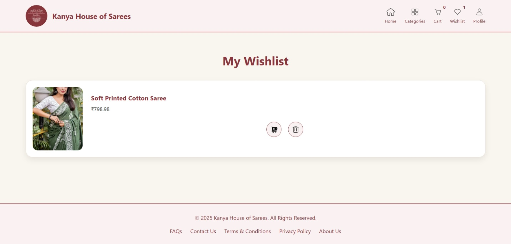

### Checkout Page

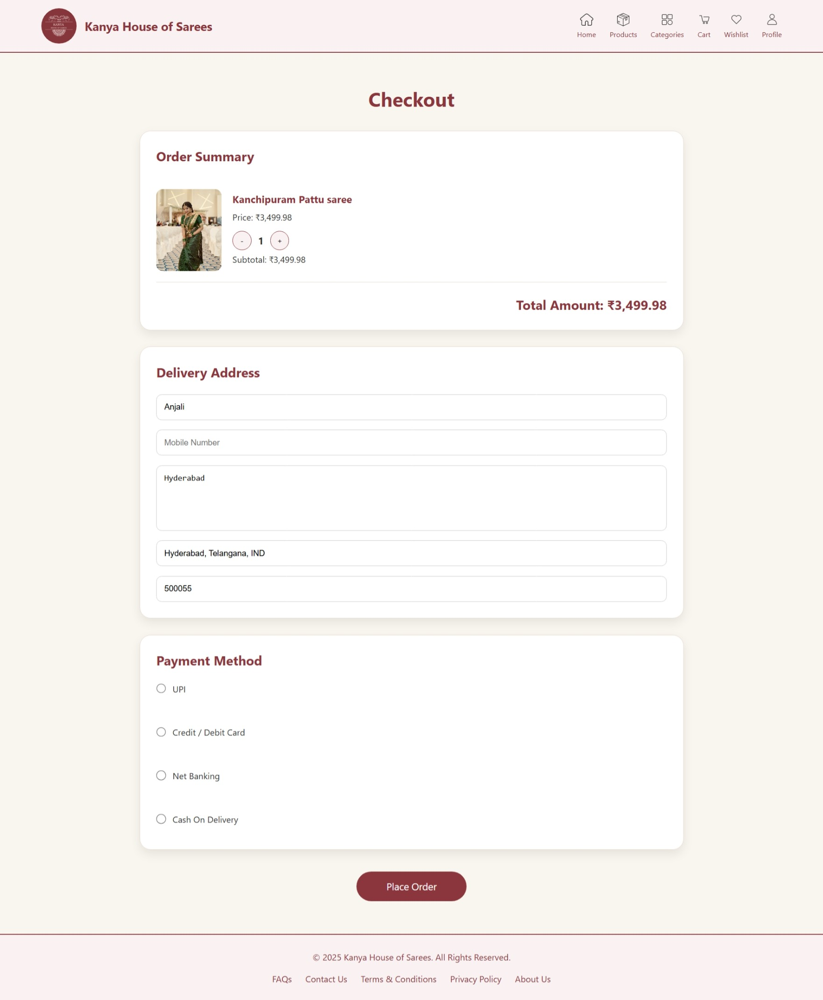

### Orders Page

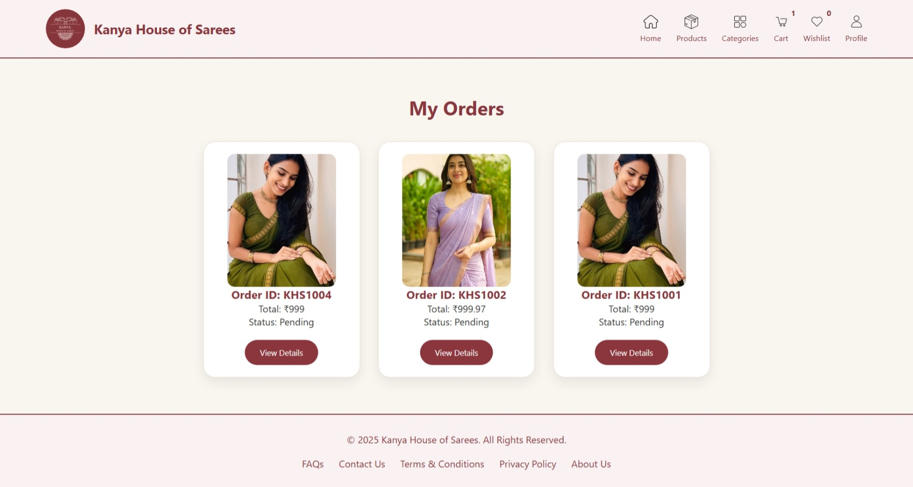

### Login Page

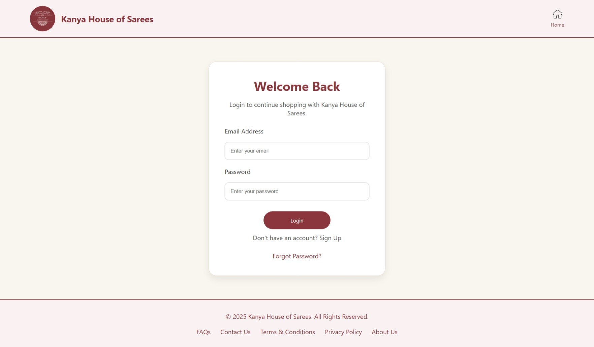

### Signup Page

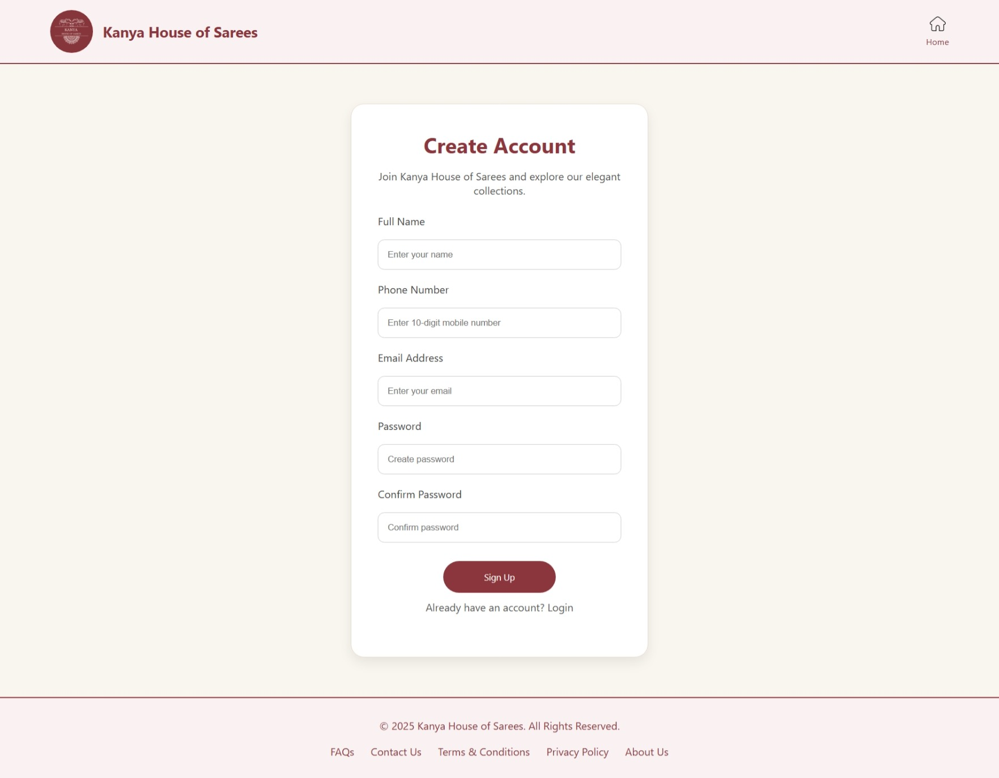

### Forgot Password Page

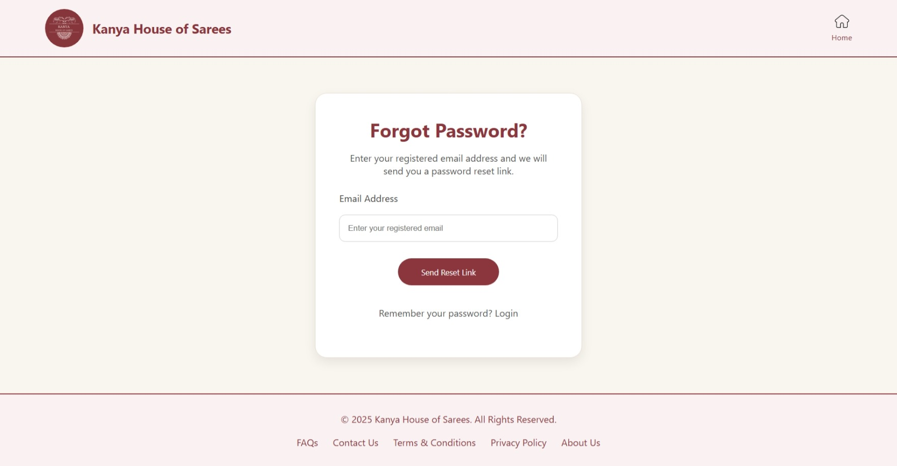

### Profile Page

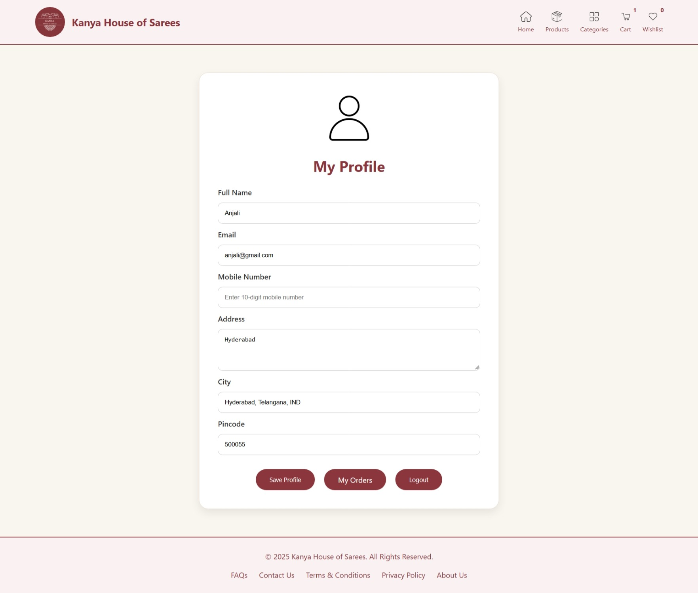

## GitHub Repository

https://github.com/dhanapriyakolli-gif/kanya-sarees.git
